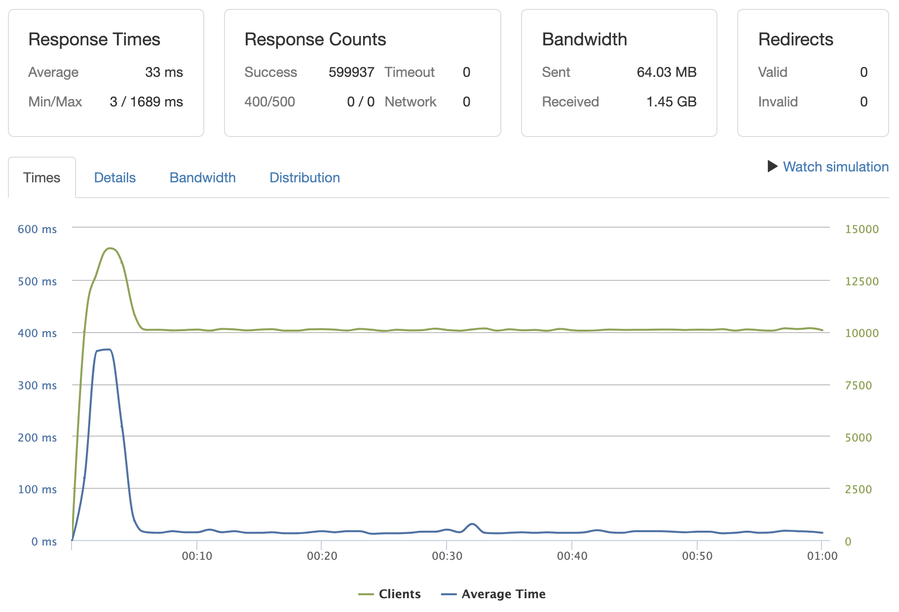

# Spear Q&A

## Recreated a RESTful API service for increased performance

[Engineering Journal](https://1drv.ms/o/s!AgXfFL3s1HZLg2qrrO0mkDPApYLq) |
[Big Wins](https://www.youtube.com/watch?v=Qd7eVNlZdKs&feature=youtu.be)

### Stress Test

Handling 10,000 GET requests per second on endpoint after implementing caching and horizontally scaling

### Technologies Used
Express
 

Postgres
 

Redis
 

Docker
 

